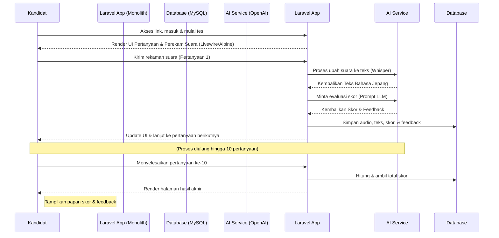
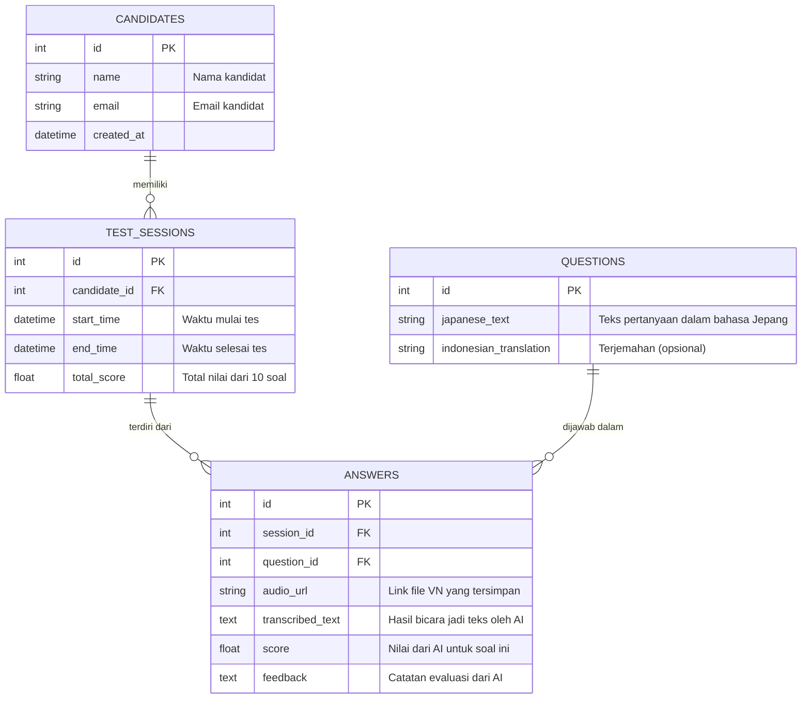

# PRD — Project Requirements Document

## 1. Overview
Proses wawancara kerja (interview) kandidat yang membutuhkan kemampuan Bahasa Jepang seringkali memakan waktu dan mengharuskan kehadiran pewawancara yang fasih berbahasa Jepang. 

Aplikasi ini bertujuan untuk menyederhanakan proses tersebut melalui platform web berbasis AI. Kandidat akan menjawab 10 pertanyaan secara lisan melalui rekaman suara di browser. Sistem AI akan mengubah suara menjadi teks, mengevaluasi kemampuan berbicara (pronunciation dan tata bahasa dasar), serta memberikan skor dan umpan balik secara otomatis. Solusi ini memberikan evaluasi yang cepat, konsisten, dan menghemat waktu bagi perusahaan klien Anda.

## 2. Requirements
*   **Aksesibilitas:** Aplikasi harus berbasis web sehingga kandidat dapat mengaksesnya hanya menggunakan tautan (link) dari browser di PC atau ponsel tanpa perlu mengunduh aplikasi tambahan.
*   **Perizenan Perangkat:** Aplikasi wajib bisa meminta izin akses mikrofon (microphone) dari perangkat pengguna.
*   **Integrasi Pihak Ketiga:** Membutuhkan integrasi dengan layanan AI (seperti OpenAI) untuk fungsi mengubah suara menjadi teks (Speech-to-Text) dan evaluasi bahasa (LLM).
*   **Penyimpanan Data:** Sistem harus bisa menyimpan file audio rekaman (Voice Note) dengan aman untuk keperluan peninjauan (review) di kemudian hari.
*   **Perjalanan Sesi:** Aplikasi membatasi jumlah pertanyaan tepat 10 soal per sesi tes.
*   **Arsitektur Terpusat:** Sistem dibangun menggunakan framework Laravel secara monolitik, menggabungkan logika backend dan rendering frontend dalam satu struktur kode untuk efisiensi pengembangan dan deployment.

## 3. Core Features
*   **Perekam Suara Terintegrasi (Voice Recording):** Tombol sederhana bagi kandidat untuk mulai merekam, menghentikan rekaman, dan mengunggah jawaban suara mereka. Menggunakan komponen interaktif (Livewire/Alpine.js) agar pengalaman pengguna tetap mulus tanpa reload halaman.
*   **Ubah Suara Menjadi Teks (Speech-to-Text API):** Menggunakan AI untuk mentranskripsi (menuliskan) apa yang diucapkan kandidat dalam bahasa Jepang secara akurat melalui backend Laravel.
*   **Evaluasi & Penilaian AI:** Sistem AI yang menganalisis teks transkripsi (dan metrik audio jika didukung) untuk menilai pelafalan, kelancaran, dan ketepatan tata bahasa, kemudian menghasilkan skor (misal: 0-100) dan umpan balik (feedback).
*   **Manajemen Soal Runtun:** Tampilan antar muka (UI) yang memandu kandidat berpindah dari pertanyaan 1 hingga pertanyaan 10 secara otomatis setelah jawaban dikirim dan diproses.
*   **Data Pertanyaan Default:** Sistem akan dilengkapi dengan 10 pertanyaan standar berikut sebagai data awal (seed data) yang siap digunakan langsung dalam sesi tes:
    1. タバコを吸いますか。お酒を飲みますか。
    2. 短所と長所を教えてください。
    3. 日本で仕事している家族か親戚はいますか。
    4. どれぐらい日本語を勉強しましたか。
    5. 共同生活は大丈夫ですか。
    6. 断食はやっていますか。
    7. お祈りの時間を調整できますか。
    8. 日本の仕事の中で職種がいっぱいありますが、なんで我々の会社で仕事したいですか。
    9. 日本へ行く目的は、割合にすると、何割仕事か、何割遊びか、正直に答えてください。
    10. 日本の文化で何を知っていますか。
*   **Dashboard Hasil Akhir:** Menampilkan rangkuman performa kandidat secara keseluruhan setelah tes selesai (skor akhir dan catatan perbaikan) melalui view ter-render oleh Laravel.

## 4. User Flow
1.  **Daftar/Masuk:** Kandidat membuka link web, memasukkan nama atau ID kandidat untuk memulai tes wawancara.
2.  **Soal Ditampilkan:** Layar menampilkan Pertanyaan ke-1 (teks/audio) melalui komponen frontend Livewire/Blade.
3.  **Rekam Jawaban:** Kandidat menekan tombol "Rekam Suara" (Voice Note), mengucapkan jawaban dalam bahasa Jepang, lalu menekan "Kirim".
4.  **Proses di Belakang Layar:** Sistem mengunggah audio ke server Laravel, mengubahnya menjadi teks melalui Whisper API, dan AI memberikan nilai untuk soal tersebut. UI diperbarui secara dinamis.
5.  **Lanjut ke Soal Berikutnya:** Langkah 2, 3, dan 4 berulang otomatis hingga Pertanyaan ke-10 selesai dikerjakan.
6.  **Hasil Akhir:** Kandidat (dan pihak perusahaan/client) dapat melihat halaman hasil berisi total skor wawancara bahasa Jepang dan umpan balik detail per pertanyaan.

## 5. Architecture
Aplikasi ini menggunakan arsitektur Monolith dengan Laravel yang menangani kedua sisi Frontend (tampilan antarmuka) dan Backend (logika, manajemen data, dan integrasi AI) dalam satu struktur kode. Livewire dan Alpine.js digunakan untuk membuat antarmuka perekaman suara yang responsif dan interaktif tanpa perlu framework frontend terpisah.

## 6. Database Schema
Untuk mendukung aplikasi simpel ini, kita membutuhkan 4 tabel utama: `candidates`, `test_sessions`, `questions`, dan `answers`.

**Penjelasan Tabel:**
*   **candidates:** Menyimpan profil pelamar (nama, email).
*   **test_sessions:** Menyimpan data sesi tes untuk merekam kapan tes dimulai, selesai, dan total skor wawancara.
*   **questions:** Menyimpan daftar 10 pertanyaan bahasa Jepang yang akan diujikan.
*   **answers:** Menyimpan setiap jawaban dari kandidat, link rekaman suaranya, teks transkripsi AI, serta skor dan feedback dari AI.

## 7. Tech Stack
Berikut adalah rekomendasi teknologi untuk membangun platform ini berdasarkan arsitektur monolith yang diminta:

*   **Framework Utama (Fullstack):** **Laravel 10/11** dalam arsitektur Monolith. Menangani routing, controller, service layer, autentikasi, manajemen file, dan query database secara terpusat.
*   **Frontend (UI & Interaksi):** **Blade Templates** untuk rendering halaman dasar, diperkuat dengan **Laravel Livewire** dan **Alpine.js** untuk menangani logika frontend, state management, dan interaksi perekaman suara secara real-time tanpa refresh halaman. **Tailwind CSS** digunakan untuk styling responsif di semua perangkat.
*   **Backend & Layanan:** Logika bisnis, validasi input, dan integrasi API pihak ketiga dikelola sepenuhnya oleh **Service Classes** dan **API Clients** di dalam struktur Laravel.
*   **Database:** **MySQL**. Handal untuk menyimpan relasi data antara kandidat, soal, sesi, dan jawaban.
*   **Layanan AI (Artificial Intelligence):** 
    *   **OpenAI Whisper API:** Untuk fitur mengubah suara berbahasa Jepang menjadi teks (Speech-to-Text) yang dipanggil via server-side Laravel.
    *   **OpenAI GPT-4o / GPT-4o-mini API:** Untuk fitur mengevaluasi teks/bahasa hasil transkripsi dan memberikan skor.
*   **Deployment (Server):** 
    *   **Hosting:** **Laravel Forge + DigitalOcean/Vultr**, **Railway**, atau **Ploi**. Semua layanan menyediakan stack PHP-FPM + Nginx yang dioptimalkan untuk Laravel.
    *   **Storage:** File audio rekaman disimpan di **AWS S3**, **Cloudinary**, atau disk lokal server yang dikelola via Laravel Storage Facade.
    *   **Proses:** Cron jobs atau Laravel Queue Worker digunakan jika pemrosesan AI perlu di-delate secara asinkron untuk menjaga performa UI.